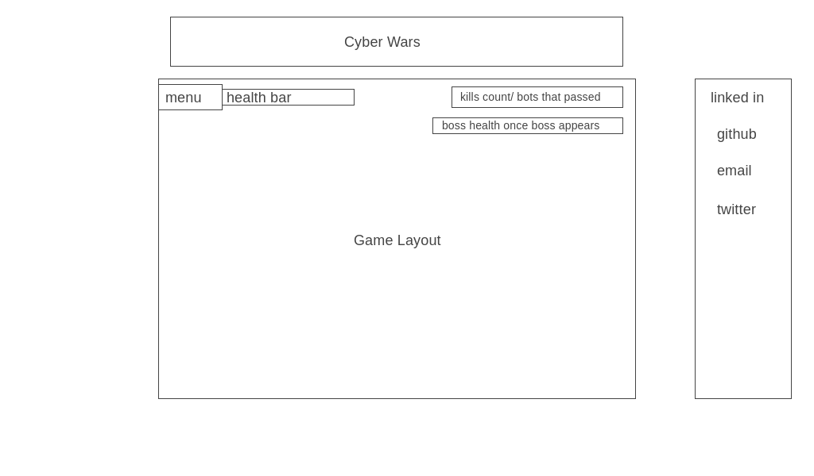

# Cyber Wars

# Background

Cyber wars is an arcade shooter style game with high resolution, in the year 2170 the robots rebelled against humans due to all the damage that we have cause to the planet, your mission is to protect one of the last standing human cities and prevent the robots from entering it.

# Functionality & MVP
Users will be able to:
 - start, pause, and restart the game 
 - move using up, down, left and right arrow keys, shoot your weapon using the Q key
 - toggle music on and off

This project will also include:
  - an about to explain rules of the game
  - links to github/linkedin
  - a production README

# Architecture and Technologies
This project will use the following technologies: 
    - Javascript for game logic
    - Canvas and Animation API
    - HTML and CSS for the layout and styling 

# Wireframe 

# Implementation Timeline

Friday Afternoon & Weekend 8/15/21 -- will start working on implementing the environment and  the background

Monday - 8/16/21 - Will have bckground up and running and have my first bots spwan on the map.

Tuesday - 8/17/21 - I will have a working skeleton with proper game logic.

Wednesday - 8/18/21 - I will have added functionality and effects/ add a menu button, start/restart button , health bars, music

Thursday Morning - 8/19/21 - The final polishing will be done.

# Credits

Art and sprites courtesy of Mobile Game Graphics https://mobilegamegraphics.itch.io/

